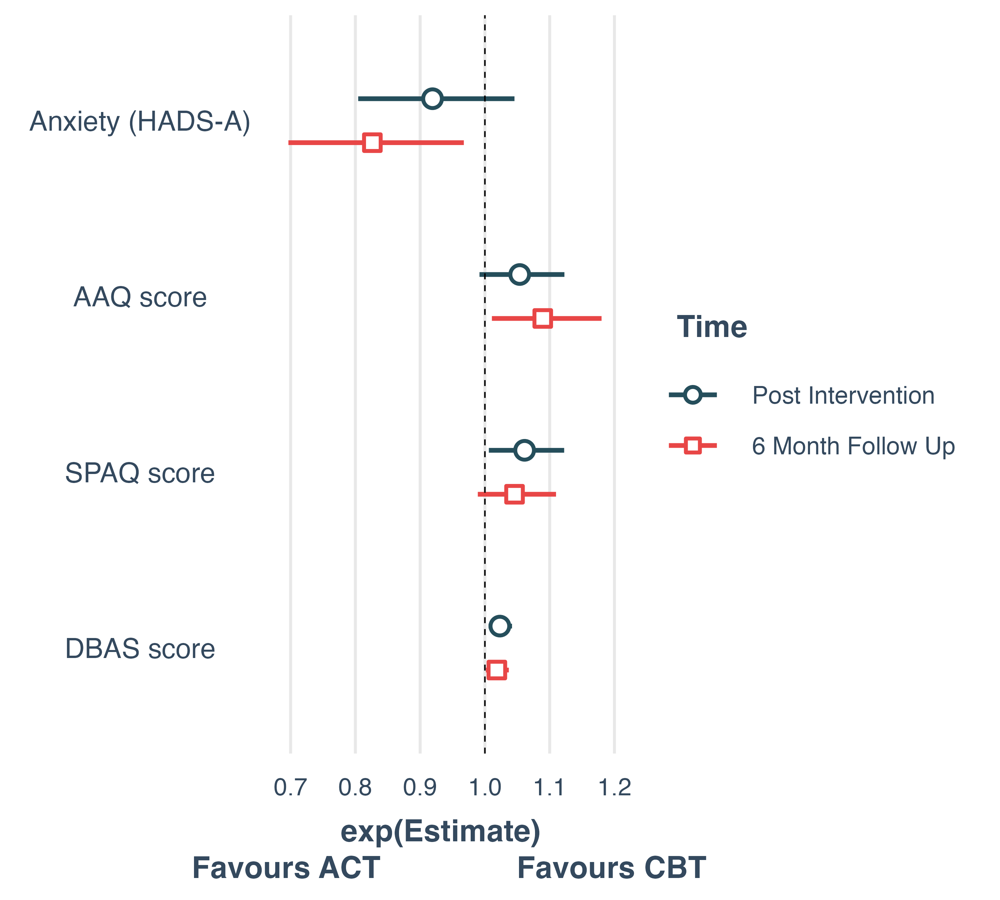

```{r, include=FALSE}
knitr::opts_chunk$set(results = 'asis',
                      echo = FALSE,
                      warning = FALSE,
                      tidy = FALSE,
                      message = FALSE,
                      fig.align = 'center',
                      out.width = "100%")
options(knitr.table.format = "html")
```

```{r}
library(kableExtra)
library(tidyverse)
```

# Introduction

Studies have shown that behavioral interventions for insomnia also promote changes in other psychiatric symptoms and psychological processes. The objective is to evaluate factors associated with acceptance and commitment therapy (ACT) compared to cognitive behavioral therapy (CBT) for insomnia before and after treatment.

# Methods

-   Participants were 152 adults meeting DSM-5 diagnostic criteria for chronic insomnia enrolled in a randomized clinical trial comparing ACT vs CBT vs WL for insomnia @renatha2024

-   Binary logistic regression in 3 moments (pre-treatment, post-treatment and 6-month follow-up) using HADS-D, HADS-A, SPAQ, AAQ and IGI as potential predictors associated with the intervention group (ACT vs CBT).

```{r, echo = FALSE}
table1 <- readr::read_csv("data/table1.csv")
```

```{r, table1}
opts <- options(knitr.kable.NA = "") #Torna os campos NA's da tabela em vazio
table1 |> 
  knitr::kable(format = "html",
    # caption = "Study participants (N = 2218) descriptive statistics.", 
    #align = 'c',
    col.names = c("","CBT", "ACT", "p-value"),
    align = "lc") |>  
  #column_spec(1, width = "30%") |> 
  #column_spec(2, width = "100%") |> 
  add_indent(positions = c(3, 4, 6, 7, 9, 10)) |> 
  kable_styling(full_width = FALSE, font_size = "82px") |> 
  #row_spec(0, background = "#CCCCCC") %>%
  #row_spec(1:nrow(table1), background = "FFFFFF") %>% 
  kable_minimal(html_font = "Rasa")
```

# Results

```{r fig-linear, fig.cap='ISI Scores in the Groups and Protocol Phases'}

knitr::include_graphics("img/rct.png")
```

```{r fig-log, fig.cap='Regression Coeficients CBT vs ACT', out.width= "90%"}

```

-   At pre-treatment, the variables were not associated with the therapeutic modality;
-   In post-treatment DBAS (OR=1.02[1.01-1.04]) and SPAQ (OR=1.06[1.01-1.12) were associated with ACT;
-   In 6-month follow-up anxiety (OR=0.83[0.70-0.97]) and AAQ (OR=1.10[1.01-1.21) were associated with CBT.

# Conclusion

-   CBT has a better effect on sleep beliefs and acceptance immediately after treatment ends and after 6 months in beliefs about sleep and psychological flexibility;

-   ACT has a better effect on anxiety after 6 months.

# References
